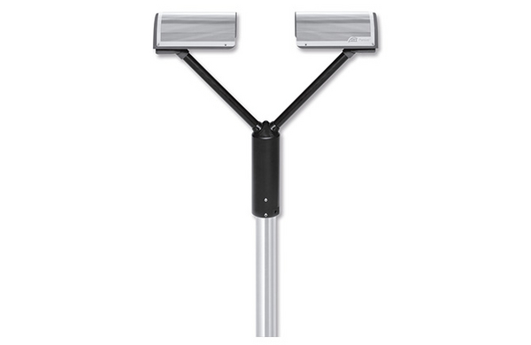
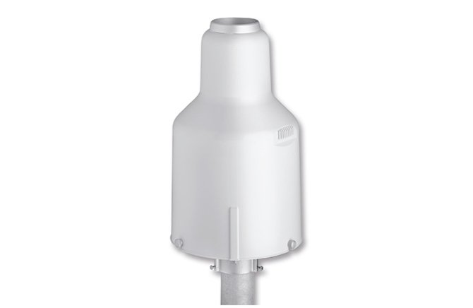
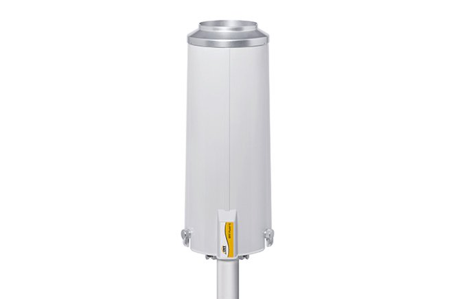
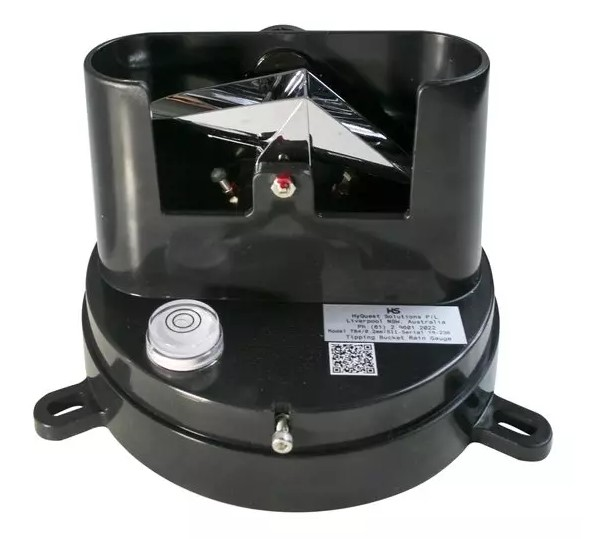
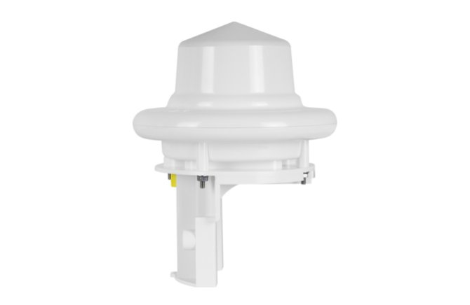

NTUCE-CompHydroMet-Lab
=========

This repository is a simple program that collect different gauge data and store them in influxdb.  
We also provide API and example to acquire data.  
All gauges are installed on the roof top of the Civil Engineering Research Building ([CERB](https://goo.gl/maps/cPMwUBwyFxDYLgTM7)) in National Taiwan University.

How to get data from our server.  
----------------------------------
In this [Influxdb official tutorial](https://docs.influxdata.com/influxdb/v2.6/query-data/), there is a complete tutorial showing how to query data from influxdb.  

## Gauges information

Here is the list of the gauges, and the measurement name in each bucket.

|OTT_Parsivel_2|Pluvio2_L_400 & Pluvio2_S|TBRG|WS100|
|:-:|:-:|:-:|:-:|
|[machine status](#machine-status)|[accu](#accu)|[closure](#closure)|[DSD](#dsd)|
|[raw_volume](#raw_volume)|[bucket](#bucket)|[daily_summary](#daily_summary)|[machine](#machine)|
|[raw_particle](#raw_particle)|[intensity](#intensity)|[precipitation](#precipitation)||
|[raw_speed](#raw_speed)|[machine](#machine)|||
|[weather_parameters](#weather_parameters)|||||

- ### Parsivel2  

  
  
  [Parsivel2 documentation](document/Parsivel2%20doc.pdf)
  
  - #### machine status  

    These measurements include some basic information of the gauge.

    Field keys:  

        Left sensor head temperature
        Right sensor head temperature
        Power supply voltage
        Sensor head heating current
        Sensor status
        Signal amplitude of laser strip
        Temperature PCB
        Temperature in the sensor housing
        
  - #### raw_volume
    
    This measurement represents the volumn equivalent diameter of each diameter class.  
    There are in total 32 diameter classes.  
    
    Field key:

        Volume eq. diameter

    Tags:
    
        Diameter Class: 
          range: 1, 2, ..., 32
  
  - #### raw_speed

    This measurement represents the speed of each speed class.  
    There are in total 32 diameter classes possible.  
    
    Field key:

        Average speed

    Tags:
    
        Diameter Class: 
          range: 1, 2, ..., 32
  
    
  
  - #### raw_particle 
    This measurement represents the count of particles within a given diameter and speed class.
        
    Field key:

        Number

    Tags:
    
        Diameter Class: 
          range: 1, 2, ..., 32

        Speed Class:
          range: 1, 2, ..., 32
  

  - #### weather_parameters
    These measurements include some basic weather parameters.  

    Field keys:  

        Kinetic energy 
        MOR visibility in precipitation  
        Radar reflectivity
        Rain Intensity  
        Rain amount accumulated  
        Weather code METER/SPECI4678  
        Weather code SYNOP 4680  

- ### Pluvio2L and Pluvio2S

  
  
  
  [Pluvio2L documentation](document/Pluvio2_L_EN.pdf)  
  [Pluvio2S documentation](document/Pluvio2_S_EN.pdf)
  
  - #### accu 
    
    These measurements include the accumulated rain (in mm) since the beginnning.  
    
    Field keys:  

        Accu NRT  
        Accu RT-NRT  
        Accu total NRT

  - #### bucket 

    These measurements include the current rain depth in the bucket (in mm).
    
    Field keys:  
    
        Bucket RT  
        Bucket NRT

  - #### intensity

    This measurement represents rainfall intensity.
    
    Field keys:  
    
        intensity

  - #### machine
  
    These measurements include some basic information about the gauge.
    
    Field keys:  
      
        Heater status
        Status
        Temperature load cell

- ### TB4 Series 2

  

  [TB4 Series 2 data logger documentation](document/ML1A_OpManualV1.pdf)
  
  - #### closure

    This measurement represents the closure time of the gauge.  
    
    Field keys:  
    
        mm  

    Since there no other value to store in field.  
    The field value is not important.  
    Use the time column of the datapoint as the closure time.

  - #### daily_summary

    This measurement represents the daily summary of closure.
    
    Field keys:  
    
        closure count

- ### WS100

    
  
  [WS100 Series documentation](document/Manual_Lufft_WSXXX_V44-EN.pdf)

  - #### DSD

    These measurements include the Drop Size Distribution related information of the precipitation.  
    
    Field keys:  

        Drop Class 0
        Drop Class 1
        Drop Class 2
        Drop Class 3
        Drop Class 4
        Drop Class 5
        Drop Class 6
        Drop Class 7
        Drop Class 8
        Drop Class 9
        Drop Class 10
        Drop Class 11
        Total Particles
        Total Drops
        Drizzle Particles
        Hail Particles
        Rain Drop Volume
        Snow Particles
  
  - #### machine
    These measurements include some basic information of the gauge.

    Field keys:

        R2S Heater Temp
        Rain Drop Volume
        Supply Voltage

  - #### precipitation
    These measurements include some basic weather parameters. Mainly precipitation parameters.

    Field keys: 

        Precipitation Intensity  
        Precipitation Quantity-Absolute  
        Precipitation Quantity-Differential  
        Precipitation Type  
        Temperature  

# RainGauge_public
